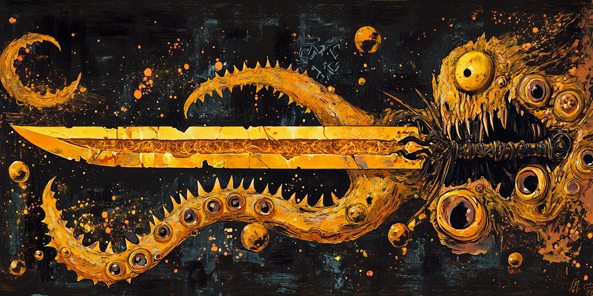

<body>

<h1>🐙 Eldrtich Runes – Project 8 of The Code Fool's Journey</h1>

<h2>📖 Overview</h2>

<h3>📌Situation</h3>

What if cosmic horror could be used to teach error handling in programming? <strong>Eldritch Runes</strong> is a terminal-based project inspired by Lovecraftian mythos. It plunges the user into a nightmare dimension where only correct incantations can break the curse.

<h3>🎯 Task</h3>

The challenge was to implement a loop where the user attempts to dispel an eldritch curse by inputting the correct combination of alien runes. The project focuses on <strong>practicing try/catch blocks, throwing exceptions</strong>, and managing logical errors with meaningful feedback. The magical failure of a spell becomes the technical failure of invalid input—a poetic way to frame exception handling.

<h3>⚙️ Action</h3>

I designed a ritual mechanic where players input a string of runes. A function compares it to the true name of power. If the spell is incorrect, we handle the error.

<h3>🧠 Result</h3>

The result is a suspenseful and interactive mini-game that blends programming logic with horror storytelling. <strong>Eldritch Runes</strong> turns basic error handling into a dramatic experience, showing how even fundamental concepts can be wrapped in thematic, memorable ways.

<h2>🌐 Multi-Language Learning Philosophy</h2>

Just like the first project, this one is being developed in Python, JavaScript, and C++. I’m studying these three languages simultaneously to avoid becoming too attached to the quirks of just one. This method helps me grasp the core logic of programming — which is universal across languages — rather than memorizing syntax. By rewriting the same project in multiple languages, I reinforce my understanding of structures, variables, functions, and flow — while also appreciating the expressive power of each language.

<h2>🧪 Project Scope: Eldritch Runes</h2>

Core concepts covered (in addition to concepts from previous projects):

<ul>
  <li>Errors and exceptions</li>
</ul>

<h1>🃏 About the Code Fool's Journey</h1>

The Fool's Journey is similar to Joseph Campbell’s famous Hero’s Journey, but instead of 12 stages, it follows 22 stages, based on the 22 Major Arcana of the Tarot. Each card represents an archetype in the evolution of the protagonist, the Fool, who embarks on a path toward knowledge and personal power, just like programmers and artists. Here, each project increases in complexity and covered concepts, from simple variables and data types to APIs, Memory Management, Databases and GUI.

<h2>📜 Previous Projects</h2>
<ul>
  <li><a href="https://github.com/CaioHerminio/Magecraft">Project 1 - Magecraft University</a></li>
  <li><a href="https://github.com/CaioHerminio/hourglassofdreams">Project 2 - Hourglass of Dreams</a></li>
  <li><a href="https://github.com/CaioHerminio/WelcomeToTheFamily">Project 3 - Welcome to the Family</a></li>
  <li><a href="https://github.com/CaioHerminio/KaijuGenerator">Project 4 - Kaiju Generator</a></li>
  <li><a href="https://github.com/CaioHerminio/GothSummoner">Project 5 - Goth Summoner</a></li>
  <li><a href="https://github.com/CaioHerminio/TarotMachine">Project 6 - Tarot Machine</a></li>
  <li><a href="https://github.com/CaioHerminio/Succonomicon">Project 7 - Succonomicon</a></li>
  </ul>

<h1>✨ Feel Free to Fork the Journey</h1>

If you find this helpful for learning or teaching, you're welcome to fork, improve, or remix it in your own way. The Fool’s path is yours to walk — and code — however you like.😊

</body>
